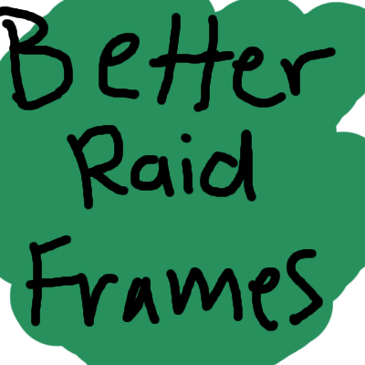

# BetterRaidFrames

A World of Warcraft addon that lets you customize the default raid frames.

 

## Features

- Role icon display options
- Custom name size, positioning and truncation
- Class color names
- Friendly absorb shield overlay
- Hostile absorb (heal debuff) overlay
- Blinking threat indicator
- Hide aura borders
- Show and adjust party leader indicator
- Dynamic custom indicators (bars, spell icons, squares)

## Usage

Type `/brf` to open the configuration window.

## Installation

1. Download the latest release
2. Extract the `BetterRaidFrames` folder to your `Interface/AddOns` directory

## Links

- https://www.curseforge.com/wow/addons/better-raid-frames

## License

BetterRaidFrames is released under the GPL-3.0 License. For more details, see the LICENSE file.
