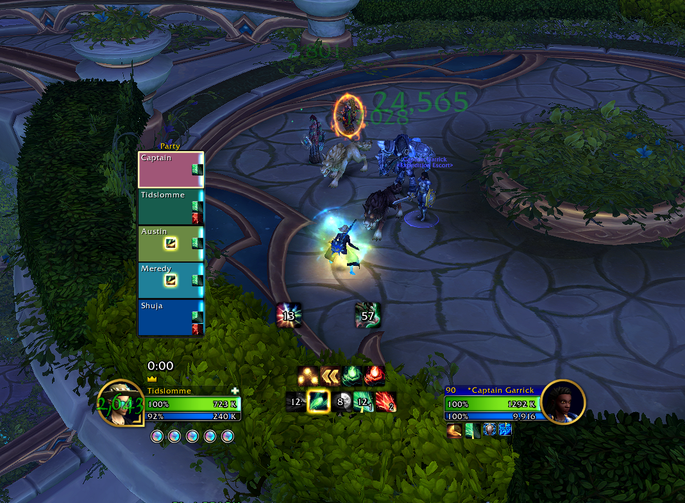

# BetterRaidFrames for Midnight

BetterRaidFrames is a lightweight World of Warcraft addon that extends Blizzard's default Raid-Style Party and Raid Frames with focused customization options.

**Made for Midnight.**

> Tip: Join a Follower Dungeon to preview and configure your frames, or use Blizzard Edit Mode.

Discord username: `async`

## Features

- Profiles with automatic Party and Raid switching
- Raid target markers with configurable anchors, offsets, and sizing
- Role icon display options
- Party leader indicator with configurable anchor, offsets, sizing, and combat visibility
- Optional name styling with positioning, sizing, truncation, class colors, transliteration, and text effects
- Square or circular threat indicator with configurable placement, sizing, blinking, tank filtering, and threat-based colours
- Indicator designer with coloured squares and spell icons, shared anchor groups that close gaps automatically, and specialization sets
- Compact, Blizzard-style configuration window
- Event-driven updates designed to avoid unnecessary frame processing

## Usage

Type `/brf` or `/betterraidframes` to open the configuration window.

## FAQ

**How do I use it?**

For Party frames, enable **Use Raid-Style Party Frames** in Blizzard Edit Mode. Configure Party and Raid frame layout in Blizzard Edit Mode.

**How do I preview my changes?**

Join a Follower Dungeon or open Blizzard Edit Mode, then type `/brf`.

**Where do I edit frame and aura sizes?**

Open Blizzard Edit Mode and select the Party or Raid Frames.

**How do I position and style names?**

Open **Name** in `/brf` and enable **Customize names**. Under **Placement**, choose one of nine anchors, then adjust X/Y relative to that point. Positive X moves right; positive Y moves up. Names align left, right, or centre to match the anchor. Existing profiles start at **Center**, preserving their saved offsets.

**Text** includes font size (6–40 pixels), class colouring, realm hiding, truncation, Cyrillic transliteration, and dead/offline visibility. **Appearance** contains outlines and text shadows. Disable **Customize names** to restore Blizzard's style and placement.

**How do I configure the threat indicator?**

Open **Threat Indicator** in `/brf` and enable **Show threat indicator**. **Visual** selects exactly one display: **Square**, **Circle**, or **Frame border**. Squares and circles have configurable anchors, offsets, and size. Frame borders follow the entire unit frame as it resizes.

- **Hide for tanks:** Hide it on units assigned the Tank role, including when they are in vehicles.
- **Colours:** Set separate colours for high threat, insecure threat, and secure threat. They default to yellow, orange, and red; **Reset colours** restores those defaults. Enable **Color by threat** to use the three colours on live frames, or leave it unchecked to use the Secure threat colour for every level.
- **Border:** Frame borders offer **Solid** (the default) or **Glow**. Solid thickness is 1–16 pixels; glow width is 1–32 pixels and starts at 8. Both use the threat colours, opacity from 0–100% (100% by default), and an inset from -16 to +16 pixels: positive moves inward, negative moves outward, and zero keeps the original position. Squares and circles keep a solid outline with their own colour; opacity affects their outline while the fill stays opaque. Blinking fades relative to the chosen border opacity. Glow reuses the existing border and blink animation without adding a Lua update loop. Previous texture selections continue to use Solid.

Three labelled samples show all threat levels only while the **Threat Indicator** section is open. Sample blinking follows **Blinking**, and stops on leaving the section or closing settings. Units without threat also show varied samples while this section is open; live threat keeps its actual level and tank filtering still applies. Outside this section, only real threat displays. All settings belong to the current profile. Restricted threat data hides the live indicator until the state is available again.

**How do I add square or icon indicators?**

Open **Indicators** in `/brf`. Enter a buff name or spell ID, or select one from **Buffs**, then click **Add**. New indicators start as spell icons; change **Display** under **Appearance** to use a square. Use the buff's aura ID when it differs from the spell that applies it. Each set supports up to 32 indicators; you can track the same buff more than once with different displays.

**Show Blizzard buff icons** toggles the standard buffs on Raid and Raid-Style Party Frames through the game's `raidFramesDisplayBuffs` setting. It is shared across profiles and stays in sync with changes made elsewhere. Your custom square and icon indicators remain independent.

- **Appearance:** Choose the size, square colour and opacity, icon texture, optional cooldown swipe, caster filter, and mouseover tooltip. Enable **Glow** for a golden glow around that indicator while its buff is active. Enable **Pulse glow** to gently fade the glow in and out every 1.2 seconds; leave it off for a steady glow. Both work with icons and squares, appear in the preview, and start disabled. Pulsing changes only the glow, keeping the icon and text steady.
- **Placement:** Choose one of nine anchors. Indicators sharing an anchor automatically form a group with shared growth direction, spacing, and X/Y offsets. The offsets move the entire group up to 250 pixels in either direction: positive X moves right, positive Y moves up. Zero offsets retain the default two-pixel inset. Use **< / >** to change the indicator order. At a corner, the first indicator sits nearest that corner. Missing and disabled buffs take no space, so the remaining indicators close the gap automatically.
- **Text:** Show remaining duration, stack count, or neither, with adjustable scale and colour. Text works independently of the cooldown swipe; an icon can hide its texture while keeping text.

**Group Z offset (layer)** in Placement adjusts the whole group's draw order from -100 to +500. Higher values draw in front, lower values behind; zero preserves the existing layer. Click **Above Blizzard icons** to set the group's offset to +200, placing it above the built-in buff, defensive, debuff, and dispel layers. The offset is relative to the unit frame's level, plus the group's base level of 10, with the final level clamped at zero. Icons, squares, text, and glow move together, and the preview uses the same setting. Existing Z offsets are preserved.

The preview shows all configured indicators. Uncheck **Selected buff active** to see the group close its gap. Groups use one row or column; reduce size or spacing if the preview reports an overflow. Separate anchor groups can overlap if made too large.

Settings belong to the current profile. **Default** applies to every specialization without its own set. Editing a specialization creates an independent copy; **Use Default** removes that override. **Export** shares the selected set, including group settings. **Import** reviews a BetterRaidFrames export before replacing that set. Harrek's export strings are not supported.

These displays use Retail 12.1's aura containers for matching, visibility, duration, and automatic layout. Changes that require access to restricted aura frames are saved and applied when restrictions end; displays awaiting those changes are hidden.

Optional cooldown, text, and glow objects allocate on first use and are then reused. Stable updates reuse their layout data; hidden previews stop their timers and pulses. Blizzard's automatic layout reserves ten buttons per indicator, so memory follows the largest pools used during a session and drops after `/reload`. See [the performance audit](PERFORMANCE.md) for measured allocation reductions, stress tests, and in-game verification steps.

**How do I highlight a buff such as Echo?**

Open **Indicators** in `/brf`, enter Echo's buff ID (`364343`), and click **Add**. It starts as a spell icon. To use a coloured square, change **Display** under **Appearance**, then choose its colour and anchor in the editor. **Mine (including pets)** tracks your casts; uncheck it to include any caster.

**Where are Blizzard's Raid Frame options?**

Go to **Options > Interface > Raid Frames**.

**How can I track targeted spells?**

Use [Targeted Spells](https://www.curseforge.com/wow/addons/targetedspells).

## Installation

1. Download the latest release.
2. Extract the `BetterRaidFrames` folder into your World of Warcraft `Interface/AddOns` directory.
3. Restart World of Warcraft or reload the UI.

## Links

- [CurseForge](https://www.curseforge.com/wow/addons/better-raid-frames)

## License

BetterRaidFrames is released under the GPL-3.0 License. See [LICENSE](LICENSE) for details.
